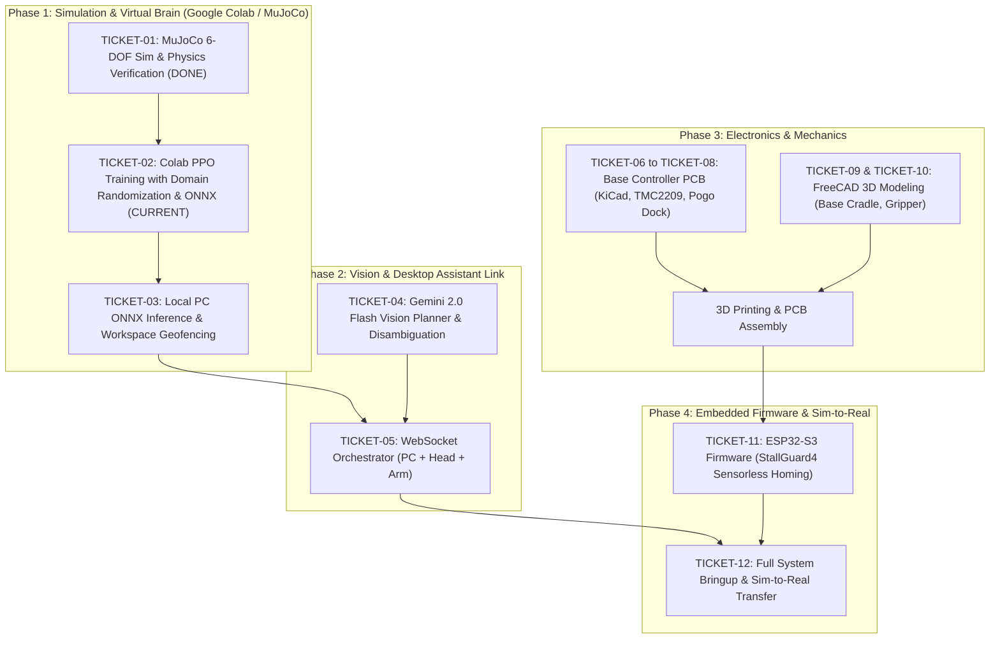

# Desktop AI Robot Arm: Beginner Guide & Master Roadmap

> **Permanent Reference Guide**: Keep this document open whenever you return to the project. It summarizes the core concepts, why we train in simulation first, the master roadmap, and where to pick up next.  
> 👉 **For the complete engineering blueprint across all subsystems, see [Master System Design Document](file:///mnt/g/projects/deskto-AI-arm/docs/SYSTEM_DESIGN_DOCUMENT.md)**.

---

## 1. Why We Train in Simulation Before Building the Physical Arm

In modern robotics, this approach is known as the **"Simulation-First" (Sim-First) paradigm**—the exact methodology used by Google DeepMind, Boston Dynamics, and cutting-edge robotics labs.

Here are the 3 major reasons we do **not** build the physical arm first:

### A. Safety & Zero Hardware Wear
* **Untrained AI is Chaotic**: An untrained Reinforcement Learning (RL) agent begins with zero knowledge. During its first 50,000 steps, it tries random motor actions—it violently flails, jerks, and overshoots.
* **Cost of Failure**: On a physical 3D-printed arm, erratic flailing would strip plastic gear teeth, snap belts, burn out motors, and crash into your table.
* **Simulation Advantage**: In [MuJoCo](file:///mnt/g/projects/deskto-AI-arm/software/models/desktop_arm_6dof.xml), a virtual crash costs $0 and resets in **1 millisecond**.

### B. Hyper-Speed Cloud Training
* **Sample Inefficiency**: For an AI arm to master reaching arbitrary 3D spatial points, it requires around 300,000 trial-and-error attempts.
* **Physical Time**: Moving a physical arm at 1 movement per second, 300,000 steps would require over **83 hours of continuous mechanical strain, battery drain, and motor heat**.
* **Cloud GPU Time**: In Google Colab on a GPU, we simulate 16 virtual robot arms simultaneously in parallel at >2,000 frames per second, finishing all 300,000 steps in **15 to 20 minutes**.

### C. Instant Mechanical Iteration
* **Flexible Dimensions**: If we discover in simulation that the arm cannot reach a certain table corner because Link 2 is 2 cm too short, we change a single number in the XML model file in 10 seconds.
* **No Wasted Filament**: If the arm were already physically 3D printed, you would have to spend days re-modeling in CAD and 12+ hours printing replacement links.

> [!IMPORTANT]
> **What MUST match between simulation and reality?**  
> The physical arm only needs to match the **kinematic dimensions** (link lengths), **joint rotation axes** (yaw vs. pitch), and **rotation angle limits**. These have already been accurately defined in [desktop_arm_6dof.xml](file:///mnt/g/projects/deskto-AI-arm/software/models/desktop_arm_6dof.xml). Whatever the AI learns in simulation transfers directly to the physical arm later.

---

## 2. Robotics & AI Terminologies Demystified

### Homography Coordinate Mapping
* **The Everyday Analogy**: If you take a photo of a rectangular notebook on a table from an angle with your smartphone, the notebook in the photo looks like a skewed trapezoid or diamond due to perspective tilt.
* **Why the Robot Needs It**: A camera produces **2D pixels** (e.g., *"The red cube is at pixel X=450, Y=320"*). But robot arm motors don't understand "pixels"—they need physical distances in meters (e.g., *"Move 15 cm forward and 6 cm to the left"*).
* **What It Does**: **Homography** is a 3x3 mathematical matrix that un-skews the camera's perspective angle, converting flat 2D camera pixels $(u, v)$ directly into real-world $(X, Y)$ table coordinates in meters.

### Synthetic Test Harness
* **The Everyday Analogy**: A flight simulator for pilot training, or a crash-test dummy setup in an automotive lab.
* **Why We Use It**: Right now, you do not have a camera clamped to your ceiling or colored blocks on your desk.
* **What It Does**: A **Synthetic Test Harness** is a standalone test script that feeds pre-rendered or sample table images into our AI code. This allows us to verify that our perception code correctly extracts coordinates, handles errors, and returns JSON before we ever plug in a physical camera.

### Domain Randomization (DR)
* **The Everyday Analogy**: A tennis player practicing on clay, grass, concrete, and in high wind so they can win on any court.
* **Why We Use It**: In pure physics simulation, everything is mathematically "perfect." In reality, a 3D-printed joint might have 10% more friction, or a motor might respond 20 milliseconds slower.
* **What It Does**: During training, we randomly perturb the simulator's friction, link weights, and reaction latencies across episodes. This prevents the neural network from overfitting to "perfect simulation" and teaches it to work reliably on real physical hardware (**Sim-to-Real**).

### ONNX (Open Neural Network Exchange)
* **The Everyday Analogy**: Training an AI model in PyTorch is like working inside a massive Hollywood production studio with expensive equipment and hundreds of tools. An **ONNX file** is like exporting the final movie as an `.mp4` file that plays instantly on any phone or laptop.
* **Why We Use It**: Google Colab uses PyTorch with GPUs to train the brain. But on your local PC or microcontrollers, running PyTorch requires gigabytes of software libraries. ONNX lets us run the finished policy in under $5\text{ ms}$ on a standard CPU with almost zero dependencies.

---

## 3. The 4-Phase Master Roadmap

```
[ Phase 1: Sim & Brain ] ──► [ Phase 2: Vision & Voice ] ──► [ Phase 3: Hardware & CAD ] ──► [ Phase 4: Bringup ]
 (MuJoCo, PPO, ONNX)           (Gemini, WebSockets)             (KiCad PCB, FreeCAD 3D)          (ESP32, Real Desk)
```



---

## 4. Current Status & Ticket Backlog

| Ticket | Title | Status | What it Delivers |
|---|---|---|---|
| **[TICKET-01](file:///mnt/g/projects/deskto-AI-arm/docs/tickets/TICKET-01-mujoco-sim-ik.md)** | MuJoCo Simulation Verification | ✅ **COMPLETED** | Verified 27-dim observation space, 6-DOF continuous control via [test_sim.py](file:///mnt/g/projects/deskto-AI-arm/software/test_sim.py). |
| **[TICKET-02](file:///mnt/g/projects/deskto-AI-arm/docs/tickets/TICKET-02-colab-ppo-training-onnx.md)** | Colab PPO Training & ONNX Export | ✅ **COMPLETED** | Vectorized training notebook with Domain Randomization and ONNX actor export (`software/models/arm_policy.onnx`). See [Lesson 0001](file:///mnt/g/projects/deskto-AI-arm/lessons/0001-colab-ppo-and-domain-randomization.html). |
| **[TICKET-03](file:///mnt/g/projects/deskto-AI-arm/docs/tickets/TICKET-03-local-pc-onnx-geofence.md)** | Local PC ONNX Inference Engine | 🎯 **NEXT UP** | Sub-5ms CPU policy evaluation with virtual desk safety geofencing. |
| **[TICKET-04](file:///mnt/g/projects/deskto-AI-arm/docs/tickets/TICKET-04-gemini-vision-planner.md)** | Gemini 2.0 Flash Vision Planner | 🎯 **READY** | Overhead camera parsing, homography mapping, and conversational disambiguation. |
| **[TICKET-05](file:///mnt/g/projects/deskto-AI-arm/docs/tickets/TICKET-05-websocket-telemetry-bridge.md)** | WebSocket Orchestrator Bridge | ⏳ Blocked by 03, 04 | Real-time message bus routing voice, vision, LCD emotions, and joint angles. |
| **[TICKET-06 to 08](file:///mnt/g/projects/deskto-AI-arm/docs/tickets/TICKET-06-base-pcb-power-pogo-dock.md)** | Base Controller PCB (KiCad) | ⏳ Ready | 24V power, 3x TMC2209 silent steppers, and pogo pin dock for Desktop Assistant. |
| **[TICKET-09 to 10](file:///mnt/g/projects/deskto-AI-arm/docs/tickets/TICKET-09-freecad-base-cradle-stepper-mounts.md)** | FreeCAD Mechanical Design | ⏳ Ready | Base enclosure, Desktop Assistant magnetic cradle, and rack-and-pinion gripper. |
| **[TICKET-11](file:///mnt/g/projects/deskto-AI-arm/docs/tickets/TICKET-11-esp32-stallguard-homing-firmware.md)** | ESP32-S3 Firmware | ⏳ Blocked by 08 | FreeRTOS stepper engine with StallGuard4 sensorless homing and collision safety. |
| **[TICKET-12](file:///mnt/g/projects/deskto-AI-arm/docs/tickets/TICKET-12-full-system-bringup-sim2real.md)** | Full System Bringup & Sim2Real | ⏳ Blocked by all | End-to-end physical desk manipulation from voice command to physical grasp. |

---

## 5. How to Resume Work Anytime

Whenever you open this project in a new window or session, simply tell the AI:
> *"I'm ready to continue. Let's work on TICKET-02 (Colab PPO Training with Domain Randomization and ONNX Export)."*

All definitions, code, and tickets remain safely saved on your disk in this repository!
