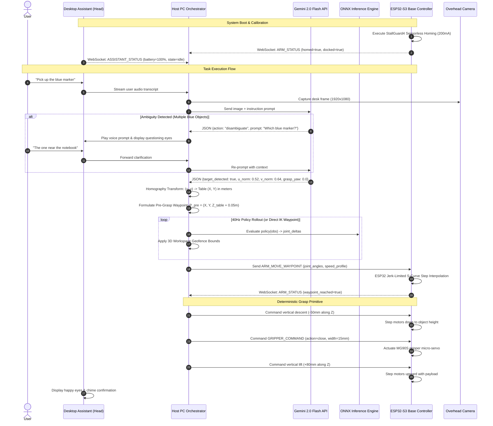
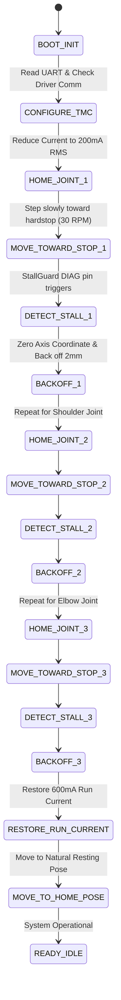
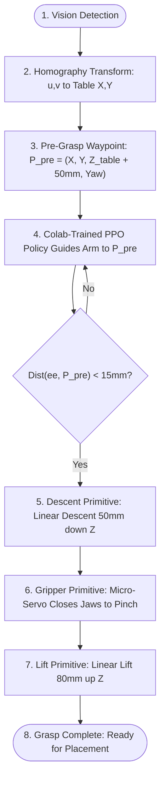

# SYSTEM-DESIGN-0001: Desktop AI Robot Arm & Desktop Assistant Ecosystem

- **Document Version**: 1.0.0
- **Status**: Authoritative Master Design Specification (`approved-for-execution`)
- **Date**: 2026-10-06
- **System Deciders**: User & Antigravity Engineering Pair
- **Associated ADRs**:
  - [ADR 0001: Hybrid Stepper-Servo Actuation & Wireless Docking](file:///mnt/g/projects/deskto-AI-arm/docs/adr/0001-hybrid-stepper-servo-and-wireless-docking.md)
  - [ADR 0002: Sensorless Homing, Base-Mounted Belt Drive, and WebSocket Architecture](file:///mnt/g/projects/deskto-AI-arm/docs/adr/0002-sensorless-homing-base-steppers-and-websockets.md)
  - [ADR 0003: 24V Bus, PLA Thermal Mitigation, and Rack-and-Pinion Gripper](file:///mnt/g/projects/deskto-AI-arm/docs/adr/0003-power-delivery-thermal-pla-and-rack-pinion-gripper.md)
  - [ADR 0004: Conversational Disambiguation, ONNX Runtime Inference, and Domain Randomization](file:///mnt/g/projects/deskto-AI-arm/docs/adr/0004-conversational-ambiguity-onnx-and-domain-randomization.md)
  - [ADR 0005: Hierarchical Grasping, Overhead Homography, and S-Curve Motion Execution](file:///mnt/g/projects/deskto-AI-arm/docs/adr/0005-hierarchical-grasping-homography-and-scurve-motion.md)
- **Domain Glossary**: [GLOSSARY.md](file:///mnt/g/projects/deskto-AI-arm/GLOSSARY.md)
- **Project Mission**: [MISSION.md](file:///mnt/g/projects/deskto-AI-arm/MISSION.md)

---

## 1. Executive Summary & System Vision

The **Desktop AI Robot Arm** is a modular, desktop-scale 6-DOF robotic manipulation system integrated with a companion **Desktop Assistant**. It serves as an accessible, high-performance hands-on laboratory for mastering modern robotic artificial intelligence, Google cloud-accelerated reinforcement learning, embedded motion firmware, PCB design, and mechanical engineering.

```
       ┌────────────────────────────────────────────────────────┐
       │             Google Colab Cloud Training                │
       │  - Headless MuJoCo 3.x Physics (16 Parallel Envs)     │
       │  - Stable-Baselines3 PPO with Domain Randomization     │
       │  - Exports: software/models/arm_policy.onnx           │
       └───────────────────────────┬────────────────────────────┘
                                   │ Model Download (.onnx)
                                   ▼
┌───────────────────────────┐             ┌─────────────────────────────┐
│    Overhead Camera Rig    │             │   Desktop Assistant Head    │
│  - Fixed table view       │             │  - Circular LCD face/eyes   │
│  - 4-point ArUco homography│             │  - Voice mic & speaker      │
└─────────────┬─────────────┘             │  - Untethered Wi-Fi battery │
              │ Video Frames              └──────────────┬──────────────┘
              ▼                                          │ Audio / UI Events
┌────────────────────────────────────────────────────────┴──────────────┐
│                    Host PC Orchestration Engine                       │
│  - Perception: Google Gemini 2.0 Flash (Spatial Object Reasoning)     │
│  - Disambiguation: Multi-turn conversational clarification           │
│  - Motion Brain: Local ONNX Runtime (<5ms CPU inference)              │
│  - Safety: 3D Cartesian Workspace Geofence Layer                      │
│  - Communication Broker: Full-Duplex JSON-over-WebSocket Server       │
└──────────────────────────────────┬────────────────────────────────────┘
                                   │ Target Waypoints & Commands (JSON)
                                   ▼
┌───────────────────────────────────────────────────────────────────────┐
│               Arm Base Controller & Physical Robot                    │
│  - MCU: ESP32-S3 (Dual-core 240MHz, FreeRTOS, S-Curve Step Generator) │
│  - Power: 24V 5A DC bus + TPS54302 Buck (5V 3A) + 3.3V LDO            │
│  - Steppers: 3x TMC2209 silent drivers (Base, Shoulder, Elbow)        │
│  - Servos: 3x Metal-gear micro-servos (Forearm, Wrist, Gripper)       │
│  - Dock: 5-pad ENIG gold pogo cradle (5V charging + dock presence)    │
│  - Safety: StallGuard4 sensorless homing + obstacle torque cut-off   │
└───────────────────────────────────────────────────────────────────────┘
```

### Core Design Pillars
1. **Simulation-First Development**: Full physics modeling in Google DeepMind MuJoCo before physical fabrication, guaranteeing zero hardware damage, 20-minute cloud GPU training runs, and rapid kinematic tuning.
2. **Hierarchical Control Pipeline**: Decoupling 3D spatial reaching (learned by cloud PPO) from contact-rich grasping (executed by deterministic descent-pinch-lift motion primitives) to achieve rock-solid physical tabletop reliability.
3. **Silent Desktop Presence**: Combining Trinamic TMC2209 StealthChop2 silent stepper drivers for high-torque base axes with lightweight metal-gear micro-servos for the wrist, eliminating irritating servo buzz and whine.
4. **Seamless Companion Symbiosis**: The Desktop Assistant mechanically and electrically seats into an ENIG gold pogo dock on the arm's base, receiving 5V 3A charging and providing expressive eyes, speech, and conversational disambiguation.

---

## 2. End-to-End System Architecture & Data Flow



---

## 3. Kinematic & Mechanical Subsystem Specification

### 3.1 Kinematic Chain & Joint Parameters

The arm is configured as a 6-DOF articulated serial manipulator with an open-chain kinematic structure:

| Joint | Anatomical Name | Motion Type | Axis of Rotation | Angular Range | Actuator Type | Transmission / Reduction | Max Velocity |
|---|---|---|---|---|---|---|---|
| **Joint 1** | Base Yaw | Revolute | $Z$-axis (vertical) | $[-180^\circ, +180^\circ]$ | NEMA 17 Stepper (17HS4401) | 3:1 GT2 Belt ($16\text{T} \to 48\text{T}$) | $180^\circ/\text{s}$ |
| **Joint 2** | Shoulder Pitch | Revolute | $Y$-axis (horizontal) | $[-90^\circ, +90^\circ]$ | NEMA 17 Stepper (17HS4401) | 4:1 GT2 Belt ($16\text{T} \to 64\text{T}$) | $120^\circ/\text{s}$ |
| **Joint 3** | Elbow Pitch | Revolute | $Y$-axis (horizontal) | $[-120^\circ, +120^\circ]$ | NEMA 14 Stepper (14HS13-0804S) | 3:1 GT2 Belt ($16\text{T} \to 48\text{T}$) | $150^\circ/\text{s}$ |
| **Joint 4** | Forearm Roll | Revolute | $Z'$-axis (along link) | $[-180^\circ, +180^\circ]$ | MG90S Metal Micro-Servo | Direct horn coupling | $300^\circ/\text{s}$ |
| **Joint 5** | Wrist Pitch | Revolute | $Y'$-axis (lateral) | $[-90^\circ, +90^\circ]$ | MG90S Metal Micro-Servo | Direct horn coupling | $300^\circ/\text{s}$ |
| **Joint 6** | Tool Roll | Revolute | $Z''$-axis (end-effector) | $[-180^\circ, +180^\circ]$ | MG90S Metal Micro-Servo | Direct spur pinion drive | $300^\circ/\text{s}$ |

### 3.2 Link Dimensions & Workspace Reach Envelope

- **Base Offset ($d_1$)**: $60\text{ mm}$ (table surface to shoulder pivot center).
- **Upper Arm Link ($a_2$)**: $140\text{ mm}$ (shoulder pivot to elbow pivot).
- **Forearm Link ($a_3$)**: $120\text{ mm}$ (elbow pivot to wrist pitch pivot).
- **Wrist / Tool Flange ($d_5$)**: $65\text{ mm}$ (wrist pivot to gripper fingertip contact center).
- **Kinematic Workspace Envelope**:
  - Horizontal Reach: $R_{min} = 120\text{ mm}$, $R_{max} = 280\text{ mm}$ (nominal tabletop radius).
  - Vertical Reach: $Z_{min} = 150\text{ mm}$ (tabletop plane), $Z_{max} = 380\text{ mm}$.
  - Rated Grasp Payload: $150\text{ g}$ nominal ($250\text{ g}$ absolute limit).

### 3.3 Base-Mounted Belt Transmission Layout

To prevent cantilever inertia from destabilizing the 3D-printed arm, the heavy stepper motors for Joints 1, 2, and 3 are mounted in the base structure:
- **Base Enclosure**: Contains the Joint 1 NEMA 17 motor driving the rotating turret via a large internal bearing (6708ZZ, $40\times 50\times 6\text{ mm}$).
- **Turret Deck**: Houses the Joint 2 NEMA 17 and Joint 3 NEMA 14 motors side-by-side.
- **Shoulder & Elbow Drive**: Dual concentric 2GT belts route upward along the Link 2 chassis. Joint 3 torque is transferred across the shoulder pivot via an idler bearing stack to isolate elbow rotation from shoulder movement.

### 3.4 Parallel-Jaw Rack-and-Pinion Gripper

```
           [  MG90S Micro-Servo  ]
                     │
              [ Spur Pinion (12T) ]
                ┌────┴────┐
                ▼         ▼
  [ Left Rack ◄ ]         [ ► Right Rack ]
         │                       │
   [ Silicone Pad ]        [ Silicone Pad ]
```
- A single MG90S metal-gear micro-servo drives a central 12-tooth spur pinion.
- The pinion simultaneously engages two opposing gear racks with linear guide rails.
- Linear jaw travel: $0\text{ mm}$ (fully closed) to $45\text{ mm}$ (fully open).
- Gripper finger tips feature $1.5\text{ mm}$ molded or adhesive silicone rubber pads with a friction coefficient $\mu \ge 0.8$, allowing firm grasping of smooth markers, plastic cubes, and metal tools.

### 3.5 Mechanical Fabrication & Thermal Mitigation
- **Filament**: Standard PLA / PLA+ with $40\%$ infill (gyroid pattern) and 4 perimeters for structural rigidity.
- **Thermal Strategy**: PLA has a low glass transition temperature ($T_g \approx 58^\circ\text{C}$). Stepper motors can easily reach $60^\circ\text{C}-70^\circ\text{C}$ under continuous holding current.
  - Base CAD incorporates an intake vent with a quiet $4010$ $24\text{V}$ brushless blower fan directing cool airflow across motor bodies and driver heatsinks.
  - Firmware enforces an automatic **Standby Hold Current** reducing coil current to $30\%$ whenever any joint remains stationary for $>200\text{ ms}$.

---

## 4. Electrical Subsystem Specification (Base Controller PCB)

### 4.1 Power Architecture Tree

```
[ 24V 5A DC Jack ] (2.1x5.5mm)
        │
        ├──► [ SMBJ28A TVS ] ──► [ P-FET Reverse Polarity ] ──► [ 24V VMOT Motor Rail ]
        │                                                              │
        │                                                ┌─────────────┴─────────────┐
        │                                                ▼                           ▼
        │                                          [ 3x TMC2209 ]               [ 4010 Fan ]
        │                                         (100uF 35V Caps)
        │
        └──► [ TPS54302 Synchronous Buck Converter ] (Step-Down 24V -> 5.0V @ 3A)
                     │
                     ├──► [ 2A PPTC Resettable Fuse ] ──► [ Pogo Pin Dock: VBUS_5V (Assistant) ]
                     ├──► [ Servo Rail 5V ] ─────────────► [ 3x MG90S Micro-Servos ]
                     │
                     └──► [ ME6211 / AMS1117-3.3 LDO ] ──► [ 3.3V Logic Bus ]
                                                                   │
                                                                   ├──► [ ESP32-S3 MCU ]
                                                                   ├──► [ TMC2209 VIO ]
                                                                   └──► [ Status LEDs / Pull-ups ]
```

### 4.2 Power Delivery Specifications
- **Input Power**: $24\text{V} \pm 5\%$ DC, $5\text{A}$ ($120\text{W}$ rated), barrel jack $2.1\times 5.5\text{ mm}$, center-positive.
- **Overvoltage & Surge Clamping**: `SMBJ28A` unidirectional TVS diode clamping transient spikes below $45\text{V}$.
- **Reverse Polarity Protection**: P-Channel MOSFET (`AO3401A` or `AOD403`) with gate pulled to ground via $100\text{k}\Omega$ resistor and zener clamped at $12\text{V}$.
- **Buck Regulator (5V 3A)**: `TPS54302` switching at $500\text{kHz}$ with a $6.8\mu\text{H}$ shielded power inductor and $2\times 22\mu\text{F}$ ceramic output capacitors, delivering $<30\text{mV}$ peak-to-peak ripple.
- **Logic LDO (3.3V)**: `ME6211` low-noise LDO ($500\text{mA}$ peak) supplying the ESP32-S3 and digital logic.

### 4.3 Trinamic TMC2209 Stepper Driver Configuration
- **Drive Mode**: StealthChop2 (silent voltage PWM) for velocity $<100\text{ RPM}$; SpreadCycle automatically engaged if high dynamic acceleration is demanded.
- **Single-Wire UART Bus**: All 3 TMC2209 drivers share a single UART bus from ESP32-S3 (`GPIO17` TX, `GPIO18` RX with a $1\text{k}\Omega$ isolating resistor between TX and RX):
  - Driver 0 (Base Yaw): `MS1=GND`, `MS2=GND` (UART Address `0x00`).
  - Driver 1 (Shoulder Pitch): `MS1=VCC_IO`, `MS2=GND` (UART Address `0x01`).
  - Driver 2 (Elbow Pitch): `MS1=GND`, `MS2=VCC_IO` (UART Address `0x02`).
- **Sensorless Homing (`DIAG` Pin)**: StallGuard4 back-EMF output from each driver is wired to a dedicated hardware interrupt pin on the ESP32-S3.

### 4.4 Desktop Assistant Pogo Pin Interface

The top deck of the base enclosure features a 5-pad ENIG gold circular pad array matching Desktop Assistant's `KZM05P03UFT2-B` spring-loaded connector:

| Pad # | Signal Name | Electrical Characteristics | Subsystem Purpose |
|---|---|---|---|
| **Pad 1** | `VBUS_5V` | $+5.0\text{V} \pm 2\%$, max $2.5\text{A}$ | Desktop Assistant internal battery charging |
| **Pad 2** | `UART_TX` | $3.3\text{V}$ LVCMOS, $115200\text{ baud}$ | Base to Assistant hardware telemetry stream |
| **Pad 3** | `UART_RX` | $3.3\text{V}$ LVCMOS, $115200\text{ baud}$ | Assistant to Base motion command stream |
| **Pad 4** | `DOCK_DETECT_N`| Active-Low with $10\text{k}\Omega$ pull-up to $3.3\text{V}$ | Hardware dock seating detection |
| **Pad 5** | `GND` | Common Ground Return ($0\text{V}$) | System reference return |

### 4.5 Complete ESP32-S3 Pin Allocation Table

| GPIO Pin | Function / Peripheral | Direction | Connected Subsystem |
|---|---|---|---|
| `GPIO1` | `STEP_J1` | Output | Joint 1 (Base Yaw) TMC2209 Step |
| `GPIO2` | `DIR_J1` | Output | Joint 1 (Base Yaw) TMC2209 Dir |
| `GPIO3` | `STEP_J2` | Output | Joint 2 (Shoulder) TMC2209 Step |
| `GPIO4` | `DIR_J2` | Output | Joint 2 (Shoulder) TMC2209 Dir |
| `GPIO5` | `STEP_J3` | Output | Joint 3 (Elbow) TMC2209 Step |
| `GPIO6` | `DIR_J3` | Output | Joint 3 (Elbow) TMC2209 Dir |
| `GPIO7` | `EN_ALL_STEP` | Output (Active-Low) | Global Stepper Driver Enable |
| `GPIO8` | `DIAG_J1` | Input (IRQ) | Joint 1 StallGuard4 Collision/Endstop |
| `GPIO9` | `DIAG_J2` | Input (IRQ) | Joint 2 StallGuard4 Collision/Endstop |
| `GPIO10` | `DIAG_J3` | Input (IRQ) | Joint 3 StallGuard4 Collision/Endstop |
| `GPIO11` | `PWM_SERVO_J4` | Output (LEDC) | Joint 4 Forearm Roll Micro-Servo |
| `GPIO12` | `PWM_SERVO_J5` | Output (LEDC) | Joint 5 Wrist Pitch Micro-Servo |
| `GPIO13` | `PWM_SERVO_J6` | Output (LEDC) | Joint 6 Gripper Micro-Servo |
| `GPIO14` | `FAN_PWM` | Output (LEDC) | 4010 Cooling Fan Low-Side N-FET Gate |
| `GPIO15` | `DOCK_DETECT_N`| Input (IRQ / Pull-Up) | Pogo Dock Seating Detection |
| `GPIO16` | `LED_STATUS` | Output | RGB WS2812 Status LED Data |
| `GPIO17` | `TMC_UART_TX` | Output (UART1) | TMC2209 Configuration Bus TX |
| `GPIO18` | `TMC_UART_RX` | Input (UART1) | TMC2209 Configuration Bus RX |
| `GPIO19` | `DOCK_UART_TX`| Output (UART2) | Pogo Pin Dock Serial TX |
| `GPIO20` | `DOCK_UART_RX`| Input (UART2) | Pogo Pin Dock Serial RX |

---

## 5. Firmware Architecture (ESP32-S3 / ESP-IDF)

### 5.1 FreeRTOS Task Architecture

```
                  ┌──────────────────────────────────────────────┐
                  │                 ESP32-S3                     │
                  │                                              │
  Core 0 (Networking & Telemetry)       Core 1 (Real-Time Motion & Safety)
  ┌─────────────────────────────┐       ┌─────────────────────────────┐
  │ Task_Comm_WS                │       │ Task_Motion_Planner         │
  │ Priority: 5                 │       │ Priority: 18 (Real-time)    │
  │ - WebSocket Client (Wi-Fi)  │◄──Queue── - 7-Phase S-Curve Planner │
  │ - JSON Parser / Serializer  │       │ - Hardware Timer Interrupt  │
  │ - Assistant Pogo UART Sync  │       │ - Step pulse generation     │
  └─────────────────────────────┘       └──────────────┬──────────────┘
                 │                                     │
                 ▼                                     ▼
  ┌─────────────────────────────┐       ┌─────────────────────────────┐
  │ Task_Telemetry              │       │ Task_Safety_Supervisor      │
  │ Priority: 3                 │       │ Priority: 24 (Highest)      │
  │ - 20Hz Telemetry Broadcast  │       │ - StallGuard IRQ Handler    │
  │ - Thermal & Current Monitor │       │ - Dock Sense IRQ Handler    │
  └─────────────────────────────┘       │ - Instant E-Stop Cut-off    │
                                        └─────────────────────────────┘
```

### 5.2 Sensorless Homing State Machine (StallGuard4)



### 5.3 Jerk-Limited S-Curve Motion Profile Algorithm

To protect 3D-printed teeth and avoid motor resonance, motion commands are executed using a 7-phase S-curve profile where the jerk $j(t) = \frac{da}{dt}$ is bounded:

$$\begin{aligned}
j(t) &\le J_{max} \quad (1500^\circ/\text{s}^3) \\
a(t) &\le A_{max} \quad (300^\circ/\text{s}^2) \\
v(t) &\le V_{max} \quad (120^\circ/\text{s})
\end{aligned}$$

The profile divides motion into 7 discrete intervals:
1. **Linear Acceleration Ramp-up**: Jerk $= +J_{max}$, acceleration increases linearly to $A_{max}$.
2. **Constant Acceleration**: Jerk $= 0$, velocity increases linearly at $A_{max}$.
3. **Linear Acceleration Ramp-down**: Jerk $= -J_{max}$, acceleration decreases to $0$, velocity reaches $V_{max}$.
4. **Cruise Phase**: Jerk $= 0$, acceleration $= 0$, velocity $= V_{max}$.
5. **Deceleration Ramp-up**: Jerk $= -J_{max}$, deceleration increases to $-A_{max}$.
6. **Constant Deceleration**: Jerk $= 0$, velocity decreases linearly at $-A_{max}$.
7. **Deceleration Ramp-down**: Jerk $= +J_{max}$, deceleration decreases to $0$, reaching target waypoint at $V = 0$.

### 5.4 Dock Safety Interlock Behavior
- When `DOCK_DETECT_N` goes HIGH (indicating the Desktop Assistant was lifted off the cradle during motion):
  - Hardware interrupt fires within $<1\text{ ms}$.
  - `Task_Safety_Supervisor` immediately commands an emergency S-curve deceleration to a stationary hold.
  - WebSocket telemetry packet `{"event": "DOCK_UNDOCKED", "arm_state": "PAUSED"}` is emitted to PC.
  - The Desktop Assistant transitions to untethered Wi-Fi mode; user can inspect the scene and verbally confirm *"Continue"* or *"Cancel"*.

---

## 6. AI Perception & Reinforcement Learning Pipeline

### 6.1 Vision & Table Homography Perception

```
[ Overhead USB Webcam ] (1080p, looking straight down at desk)
         │
         ├── Step 1: ArUco / 4-Corner Calibration Matrix H (3x3)
         │           [X_real, Y_real, 1]^T = H * [u_norm, v_norm, 1]^T
         │
         └── Step 2: Google Gemini 2.0 Flash Spatial Prompting
```

#### Gemini 2.0 Flash Spatial Vision Schema
The host PC passes camera frames to Gemini 2.0 Flash along with the user's verbal instruction:
```json
{
  "system_instruction": "You are the spatial perception planner for a 6-DOF desktop robot manipulator. Identify the target item matching the user's intent. Output normalized coordinates (0.0 to 1.0) and detect any ambiguities.",
  "expected_output_schema": {
    "action": "execute_grasp | disambiguate | target_not_found",
    "clarification_question": "string | null",
    "target_detected": true,
    "object_class": "blue marker",
    "normalized_centroid": {"u": 0.542, "v": 0.618},
    "bounding_box": [0.51, 0.58, 0.57, 0.65],
    "approach_yaw_degrees": 15.0,
    "confidence": 0.94
  }
}
```

#### Conversational Disambiguation Flow
If multiple similar items reside on the desk (e.g., two blue pens), Gemini outputs `"action": "disambiguate"`. The PC relays this to Desktop Assistant, which prompts the user verbally (*"I see two blue pens. Do you want the one near the notebook or the one in the center?"*) while displaying an inquisitive expression on its circular LCD.

### 6.2 MuJoCo Gymnasium Continuous Control Environment

The simulation environment is defined in [software/arm_env_3d.py](file:///mnt/g/projects/deskto-AI-arm/software/arm_env_3d.py) with the physical robot model in [software/models/desktop_arm_6dof.xml](file:///mnt/g/projects/deskto-AI-arm/software/models/desktop_arm_6dof.xml):

- **Action Space**: $\text{Box}(-1.0, 1.0, \text{shape}=(6,), \text{float32})$
  Continuous joint position deltas: $\Delta q_i = a_i \times \Delta \theta_{max}$, where $\Delta \theta_{max} = 0.05\text{ rad}$ ($2.86^\circ$).
- **Observation Space**: $\text{Box}(-\infty, +\infty, \text{shape}=(27,), \text{float32})$
  $$\mathcal{O} = [\cos(q_{0..5}), \sin(q_{0..5}), \dot{q}_{0..5}, p_{ee}, p_{target}, (p_{target} - p_{ee})]$$
  - $\cos(q), \sin(q)$: Continuous representation of 6 joint angles, avoiding $2\pi$ wrap-around singularities ($12\text{ dims}$).
  - $\dot{q}$: Joint angular velocities ($6\text{ dims}$).
  - $p_{ee}$: Current 3D Cartesian coordinates of end-effector tracking site ($3\text{ dims}$).
  - $p_{target}$: Target 3D coordinates $(X, Y, Z)$ in meters ($3\text{ dims}$).
  - $(p_{target} - p_{ee})$: 3D vector difference directly informing the actor of spatial distance and approach heading ($3\text{ dims}$).

- **Reward Function**:
  $$R_t = -\|p_{ee} - p_{target}\|_2 - 0.005 \sum_{i=1}^6 a_i^2 + R_{bonus}$$
  Where:
  $$R_{bonus} = \begin{cases} 
  +2.0 & \text{if } \|p_{ee} - p_{target}\| < 0.03\text{ m} \quad (\text{Success condition}) \\
  +0.5 & \text{if } \|p_{ee} - p_{target}\| < 0.06\text{ m} \quad (\text{Proximity shaping}) \\
  0.0 & \text{otherwise}
  \end{cases}$$

### 6.3 Domain Randomization (Sim-to-Real Bridge)

During PPO training on Google Colab, physical dynamics parameters are perturbed across episodes:
- **Joint Friction & Damping**: $D_{joint} \sim \mathcal{U}(0.8 \times D_0, 1.2 \times D_0)$ ($\pm 20\%$).
- **Link Masses & Center-of-Mass**: $M_{link} \sim \mathcal{U}(0.85 \times M_0, 1.15 \times M_0)$ ($\pm 15\%$).
- **Actuation Latency**: Injected queue delay $t_{delay} \sim \mathcal{U}(10\text{ ms}, 30\text{ ms})$ to model Wi-Fi and buffer delays.
- **Action Noise**: Gaussian perturbation $\epsilon \sim \mathcal{N}(0, 0.02\text{ rad})$ injected into motor step increments.

### 6.4 Model Export & Local Host PC Execution
1. Following convergence on Google Colab (>85% success rate), the policy actor network is exported to ONNX format:
   ```python
   torch.onnx.export(
       model.policy.mlp_extractor.policy_net,
       dummy_observation,
       "software/models/arm_policy.onnx",
       input_names=["observation"],
       output_names=["action"],
       dynamic_axes={"observation": {0: "batch"}, "action": {0: "batch"}}
   )
   ```
2. The host PC executes `software/models/arm_policy.onnx` via `onnxruntime` (<5ms CPU latency per forward pass).
3. **Workspace Geofence Layer**: The output trajectory is clamped within physical boundaries:
   $$\begin{aligned}
   0.12\text{ m} &\le \sqrt{X^2 + Y^2} \le 0.28\text{ m} \\
   0.165\text{ m} &\le Z \le 0.380\text{ m}
   \end{aligned}$$
   This mathematically prevents the robot from driving into the table surface or self-colliding with the base enclosure.

### 6.5 Hierarchical Grasp Execution Sequence



---

## 7. Communication & Protocol Specification

All communication between the Host PC, Desktop Assistant, and Base Controller flows as structured JSON over full-duplex WebSockets.

### 7.1 Telemetry Broadcast (`ARM_STATUS`)
Emitted periodically at $20\text{ Hz}$ by ESP32-S3:
```json
{
  "type": "ARM_STATUS",
  "timestamp_ms": 1425890,
  "homed": true,
  "dock_seated": true,
  "state": "IDLE | EXECUTING | PAUSED | ESTOP",
  "joint_angles_deg": [12.4, 45.0, -32.1, 0.0, 15.0, 0.0],
  "end_effector_pos_m": [0.185, 0.042, 0.215],
  "gripper_width_mm": 45.0,
  "bus_voltage_v": 24.1,
  "current_ma": 420,
  "tmc_temperature_c": 38.5,
  "last_error": null
}
```

### 7.2 Waypoint Motion Command (`ARM_MOVE_WAYPOINT`)
Sent from Host PC to ESP32-S3:
```json
{
  "type": "ARM_MOVE_WAYPOINT",
  "command_id": "cmd_9482",
  "target_joint_angles_deg": [25.0, 35.0, -20.0, 0.0, 10.0, 0.0],
  "max_velocity_pct": 80,
  "acceleration_time_ms": 400,
  "blend_radius_mm": 10.0
}
```

### 7.3 Gripper Actuation Command (`GRIPPER_COMMAND`)
Sent from Host PC to ESP32-S3:
```json
{
  "type": "GRIPPER_COMMAND",
  "command_id": "grp_102",
  "action": "open | close | set_width",
  "target_width_mm": 20.0,
  "holding_torque_pct": 75
}
```

### 7.4 Safety & Collision Alert (`SAFETY_ALERT`)
Sent from ESP32-S3 to Host PC upon StallGuard trigger or geofence violation:
```json
{
  "type": "SAFETY_ALERT",
  "timestamp_ms": 1426110,
  "trigger": "STALLGUARD_OBSTACLE | GEOFENCE_LIMIT | EMERGENCY_STOP",
  "axis_affected": "JOINT_2_SHOULDER",
  "stall_load_value": 482,
  "action_taken": "TORQUE_CUT_DECELERATED",
  "recommended_user_action": "Inspect workspace for obstacles and confirm resume"
}
```

---

## 8. Sim-to-Real Bringup, Calibration & Testing Seams

### 8.1 Testing Seams & Verification Gates

```
┌────────────────────────────────────────────────────────────────────────┐
│                        Master Testing Seams                            │
├────────────────────────────────┬───────────────────────────────────────┤
│ Seam 1: MuJoCo Physics Sim     │ software/test_sim.py                  │
│                                │ Verifies 27-dim obs, bounds & reward  │
├────────────────────────────────┼───────────────────────────────────────┤
│ Seam 2: Synthetic Vision       │ software/test_synthetic_vision.py     │
│                                │ Verifies Gemini JSON & Homography     │
├────────────────────────────────┼───────────────────────────────────────┤
│ Seam 3: ONNX Inference & Fence │ software/test_onnx_geofence.py        │
│                                │ Verifies <5ms forward pass & clamping │
├────────────────────────────────┼───────────────────────────────────────┤
│ Seam 4: WebSocket Protocol     │ software/test_ws_protocol.py          │
│                                │ Verifies full-duplex JSON schema      │
├────────────────────────────────┼───────────────────────────────────────┤
│ Seam 5: Embedded Stepper HIL   │ firmware/test_stepper_hil.c           │
│                                │ Verifies step accuracy & StallGuard   │
└────────────────────────────────┴───────────────────────────────────────┘
```

### 8.2 Bringup Procedure (Step-by-Step)
1. **Kinematic Dimension Audit**: Measure physical 3D-printed link lengths from pivot to pivot and verify exact match with `desktop_arm_6dof.xml`.
2. **StallGuard Sensitivity Sweep**: Run automated tuning firmware script sweeping `SGTHRS` from $0$ to $255$ against mechanical hardstops to identify the sweet spot without false triggers.
3. **Overhead Camera Homography Calibration**: Place an ArUco 4-corner calibration board on the desk. Run calibration script to compute and save the $H_{3\times 3}$ matrix.
4. **Open-Loop Waypoint Dry Run**: Command 5 discrete waypoints without an object. Verify smooth S-curve acceleration and correct end-effector height.
5. **Full Closed-Loop Sim-to-Real Pick-and-Place**: Place a 30mm colored cube on the table. Execute voice-driven pick, lift, and return.

---

## 9. Failure Modes, Hazards & Safety Interlocks Matrix

| Failure Mode / Hazard | Root Cause | Detection Mechanism | Immediate Firmware / System Action | Recovery Procedure |
|---|---|---|---|---|
| **Collision with Obstacle / Hand** | Foreign object obstructing arm path | TMC2209 StallGuard back-EMF spike on `DIAG` pin | FreeRTOS IRQ commands immediate torque cut / deceleration within $<2\text{ ms}$; emits `SAFETY_ALERT` | Clear obstacle; send resume command via Desktop Assistant or PC |
| **Tabletop Strike** | Target coordinate generated below desk surface | Host PC 3D Workspace Geofencing layer | Setpoint clamped to $Z \ge 0.165\text{ m}$ before packet is transmitted to ESP32 | Automatic; robot reaches safe minimum clearance |
| **Desktop Assistant Undocked During Motion** | User picks up Desktop Assistant from base | Hardware `DOCK_DETECT_N` pin pulled HIGH | Arm immediately executes controlled S-curve deceleration to stationary hold | Desktop Assistant switches to untethered Wi-Fi; asks user to confirm resume |
| **Belt Tooth Skipping** | Loose belt tension or excessive acceleration | StallGuard load deviation or visual misplacement | Motor stops if load exceeds threshold; S-curve profiles cap jerk to $1500^\circ/\text{s}^3$ | Re-tighten GT2 idler tensioning screw and re-home axis |
| **PLA Motor Mount Softening** | Heat transfer from motor cans ($>55^\circ\text{C}$) | Temperature sensor / duration monitor | Standby hold current automatically drops to $30\%$ during pauses; 4010 fan runs continuously | Check fan airflow duct; ensure firmware hold current is active |
| **Wi-Fi Packet Drop / Host Disconnect** | Network congestion or PC software crash | WebSocket heartbeat timeout ($>500\text{ ms}$) | ESP32-S3 automatically decelerates active motion to safe hold | Reconnect WebSocket; state restored automatically |
| **Visual Target Ambiguity** | Multiple identical objects matching query | Gemini 2.0 Flash confidence score and candidate list | Robot pauses; Assistant speaks clarification query and shows questioning face | User provides verbal disambiguation (*"The left one"*) |

---

## 10. Master Phasing & Milestone Roadmap

### Phase 1: Simulation & Virtual Brain (MuJoCo, Colab, ONNX)
- **TICKET-01**: MuJoCo 6-DOF Environment & Physics Verification. ✅ **COMPLETED**.
- **TICKET-02**: Colab PPO Training with Domain Randomization & ONNX Export. 🎯 **NEXT UP**.
- **TICKET-03**: Local PC ONNX Inference Engine & Workspace Geofence. ⏳ Blocked by 02.

### Phase 2: Vision & Assistant Interaction (Gemini & WebSockets)
- **TICKET-04**: Gemini 2.0 Flash Vision Planner & Homography Mapping. 🎯 **READY**.
- **TICKET-05**: WebSocket Orchestrator Bridge (PC + Assistant + Base MCU). ⏳ Blocked by 03, 04.

### Phase 3: Hardware & Electronics (KiCad PCB & FreeCAD 3D CAD)
- **TICKET-06**: Base PCB Power Tree (24V $\to$ 5V Buck $\to$ 3.3V LDO) & Pogo Dock. ⏳ Ready.
- **TICKET-07**: Base PCB Stepper & Servo Stage (3x TMC2209 UART & Micro-Servos). ⏳ Ready.
- **TICKET-08**: Base PCB Layout, Copper Routing, & Thermal Pours. ⏳ Blocked by 06, 07.
- **TICKET-09**: FreeCAD Mechanical Design: Base Enclosure, Cradle & Stepper Mounts. ⏳ Ready.
- **TICKET-10**: FreeCAD Mechanical Design: Rack-and-Pinion Parallel Gripper. ⏳ Ready.

### Phase 4: Embedded Firmware & Sim-to-Real Bringup (ESP32 & Real Desk)
- **TICKET-11**: ESP32-S3 Firmware (FreeRTOS, S-Curves, StallGuard4 Homing). ⏳ Blocked by 08.
- **TICKET-12**: Full System Bringup, Sim-to-Real Transfer & Tabletop Grasping. ⏳ Blocked by all.
